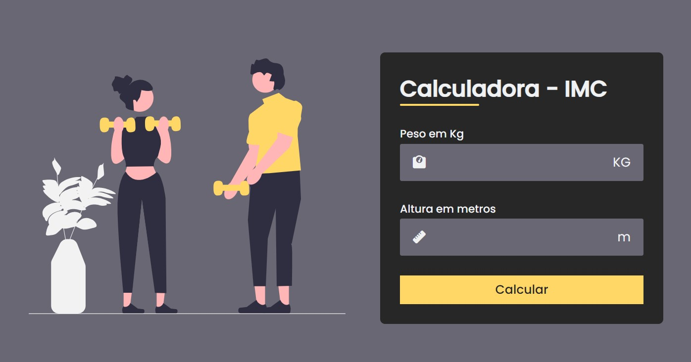

# Calculadora de IMC 🏋🏻‍♀️

Esse repositório tem um código para cálculo do IMC (Índice de Massa Corporal), feito com base no tutorial disponibilizado por Larissa Kich em seu canal do YouTube. Caso queira conferir o conteúdo original, você pode acessá-lo pelo seguinte link: [Tutorial de Cálculo de IMC](https://www.youtube.com/watch?v=UBYqkpsafyI).

O código foi desenvolvido utilizando apenas **HTML**, **CSS** e **JavaScript**, garantindo uma experiência **totalmente responsiva**. Para aprimorar o design, utilizei recursos de sites como **FontAwesome** para ícones, **unDraw** para ilustrações e **Google Fonts** para tipografia.

### Repositório Criado por

- **Maria Carolina**
  - GitHub: [@wcarolc](https://github.com/wcarolc)

### Autor do Tutorial

- **Larissa Kich**
  - GitHub: [@Larissakich](https://github.com/Larissakich)
  - YouTube: [Larissa Kich](https://www.youtube.com/@Larissakich)
